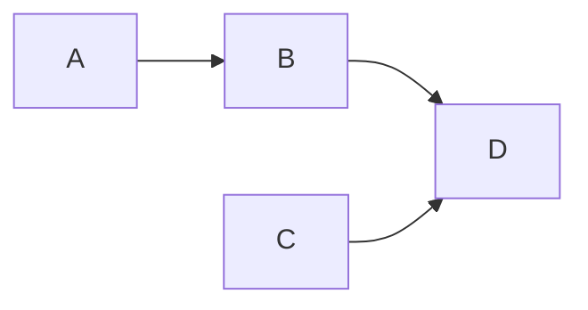

# Data Engineering

- Gather as much domain knowledge as possible. Technical knowledge is not enough. Then prioritize:
  - **Fidelity:** how reliably can data be transferred and stored without corruption or loss?
  - **Capacity:** how much data can be moved and how quickly?
  - **Reliability:** how well can systems recover from outages and incidents?
  - **Speed of execution:** how quickly can you get a new data source up and running?
- If it can be solved with SQL, stick to SQL.
  - SQL will be the abstraction layer in streaming too so you don't have to care about incremental materialization or timely dataflows.
- A [consistent pattern](https://www.startdataengineering.com/post/design-patterns/) across your data pipelines helps devs communicate easily and understand code better.
- Data Engineering can learn from decentralized systems ideas like, Content Addressed Data, Immutability, and [[Idempotence]].
- [Schemas aren't eliminated by using a "schemaless" data store](https://ludic.mataroa.blog/blog/flexible-schemas-are-the-mindkiller/) (like a NoSQL database). They're just pushed to the reading layer.
- [Bring compute to data instead of data to compute](https://youtu.be/S0mviKhVmBI)!

## Data Pipelines

Data Pipelines are a set of actions that extract data, transform it, and then load the final data somewhere. As any [distributed system](https://www.somethingsimilar.com/2013/01/14/notes-on-distributed-systems-for-young-bloods/), they're tricky to work with. These are some great principles to keep in mind as [production data engineering is mostly computer science](https://web.archive.org/web/20221218002759/https://towardsdatascience.com/lessons-from-a-year-in-the-data-science-trenches-f06efa6355fd).

Systems tend towards production and data pipelines aren't an exception. Valuable data work and outputs end up being consumed in use cases that are increasingly more important / production grade.

### Basic Principles

- **Simplicity**: Each steps is easy to understand and modify. Rely on immutable data. Write only. No deletes. No updates. Avoid having too much "state". Hosting static files on S3 is much less friction and maintenance than a server somewhere serving an API.
- **Reliability**: Errors in the pipelines can be recovered. Pipelines are monitored and tested. Data is saved in each step (storage is cheap) so it can be used later if needed. For example, adding a new column to a table can be done extracting the column from the intermediary data without having to query the data source. It is better to support 1 feature that works reliably and has a great UX than 2 that are unreliable or hard to use. One solid step is better than 2 finicky ones.
- **[[Modularity]]**: Steps are independent, declarative, and [[Idempotence|idempotent]]. This makes pipelines composable.
- **Consistency**: Same conventions and design patterns across pipelines. If a failure is actionable by the user, clearly let them know what they can do. Schema on write as there is always a schema.
- **Efficiency**: Low event latency when needed. Easy to scale up and down. A user should not be able to configure something that will not work. Don't mix heterogeneous workloads under the same tooling (e.g: big data warehouses doing simple queries 95% of their time and 1 big batch once a day).
- **Flexibility**: Steps change to conform data points. Changes don't stop the pipeline or losses data. Fail fast and upstream.

### Data Flow

- In each step of the pipeline there are producers of data and consumers. Consumers can be also producers, e.g `B` is both consumer of `A`'s data and producer of `C`s data.
  - Decouple producers and consumers adding a layer in between. That can be something as simple as a text file or complex as a [[Databases|database]].
- **Schemas changes**. Most of the time you won't be there at the exact time of the change so aim to save everything.
  - Ideally, the schema will evolve in a backward compatible way:
    - Data types don't change in the same column.
    - Columns are either deleted or added but never renamed.
- Create a few extra columns like `processed_at` or `schema_version`.
- Generate stats to provide the operator with feedback.
- Data coming from pipelines should be easily reproducible. If you want to re-run a process, you should ensure that it will produce always the same result. This can be achieved by enforcing the [Functional Data Engineering Paradigm](https://medium.com/@maximebeauchemin/functional-data-engineering-a-modern-paradigm-for-batch-data-processing-2327ec32c42a).
- [Event Sourcing is a great pattern when implementing a new system since it couples state with business logic](https://youtu.be/XxKnTusccUM).
  - State is a projection of history. Keep the history and reconstruct the state!
- Embrace immutability:
  - [Avoid states and mutable data. Functions should always yield the same result!](https://twitter.com/sbalnojan/status/1521477031405531136)
  - Objects will be more thread safe inside a program.
  - Easier to reason about the flow of a program.
  - Easier to debug and troubleshoot problems.
  - [We need immutability to coordinate at a distance and we can afford immutability, as storage gets cheaper](https://www.cidrdb.org/cidr2015/Papers/CIDR15_Paper16.pdf).

## Great Blog Posts

- [The AI Hierarchy of Needs](https://hackernoon.com/the-ai-hierarchy-of-needs-18f111fcc007).
- [Why is data hard?](https://medium.com/@HelenLeeKupp/why-is-data-hard-3ed96ec70f3f).
- [Building a Data Pipeline from Scratch](https://medium.com/the-data-experience/building-a-data-pipeline-from-scratch-32b712cfb1db).
- [A Beginner's Guide to Data Engineering Part I](https://medium.com/@rchang/a-beginners-guide-to-data-engineering-part-i-4227c5c457d7) and [Part II](https://medium.com/@rchang/a-beginners-guide-to-data-engineering-part-ii-47c4e7cbda71).
- [The Rise of the Data Engineer](https://www.freecodecamp.org/news/the-rise-of-the-data-engineer-91be18f1e603/).
- [The Downfall of the Data Engineer](https://medium.com/@maximebeauchemin/the-downfall-of-the-data-engineer-5bfb701e5d6b).
- [Functional Data Engineering — a modern paradigm for batch data processing](https://medium.com/@maximebeauchemin/functional-data-engineering-a-modern-paradigm-for-batch-data-processing-2327ec32c42a).
- [So You Want to be a Data Engineer?](https://angelddaz.substack.com/p/so-you-want-to-be-a-data-engineer).
- [Reshaping Data Engineering](https://preset.io/blog/reshaping-data-engineering/)
